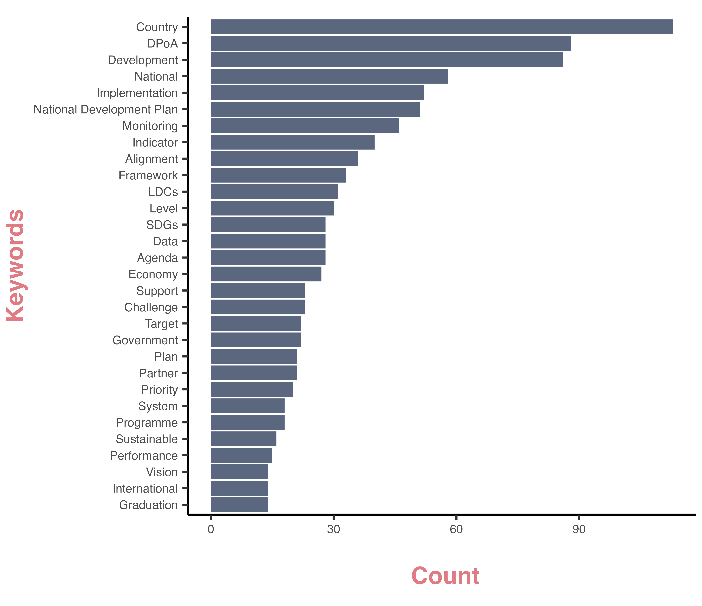

# Text Analysis:  Top 30 Most Mentioned Words 

Author: Nicole Golden  Date: August 10, 2023 

## Data Source
* UN OHRLLS, [LDCs NFPs Meeting 2023](https://www.un.org/ohrlls/events/ldcs-nfps-meeting-2023), [Summary Report of Meeting of National Focal Points of LDCs, Session I and Session II](https://www.un.org/ohrlls/sites/www.un.org.ohrlls/files/summary_report_of_meeting_of_ldc_nfps_2023.pdf)

## About this project
* The `data.txt` file, located in the `data` folder, contains compiled text from the document titled "Summary Report of Meeting of National Focal Points of LDCs, Session I and Session II." 
* The project entails the compilation of the 30 most frequently mentioned words, offering valuable insights into the pressing priorities for national focal points.

## Data Methodology
* Most special characters (such as `%`, and `:`) are removed in the data. To ensure consistency of the data analysis:  (i) The key plural nouns formatted as singular words;  (ii) The key verbs are formatted as singular nouns; (iii) The term "national development plan" has been consolidated into 'NationalDevelopmentPlan' for analytical purposes.

## Figure: 
Top 30 Most Mentioned Words mentioned at the LDCs NFPs Meeting 2023

